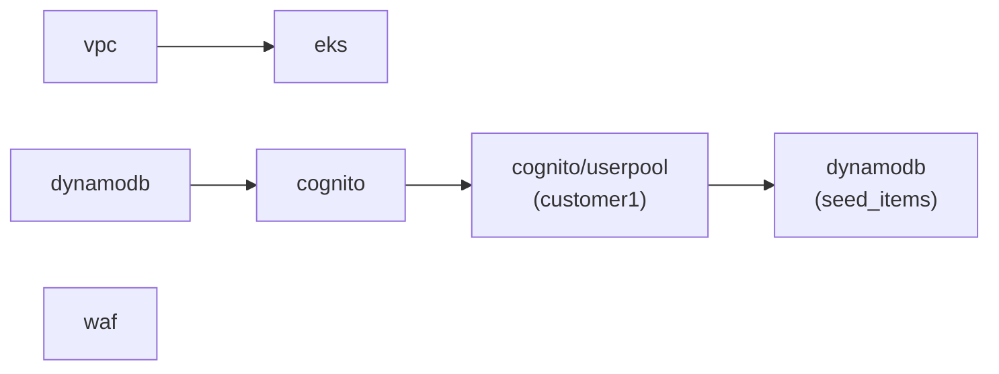

# Lab Deployment

`examples/lab/` is the concrete deployment for this lab. It calls every module in `src/` and wires their outputs together.

## The `locals` pattern

All shared configuration is declared once in a `locals {}` block at the top of `main.tf` and referenced throughout. Nothing is hard-coded inside individual module calls.

```hcl
locals {
  name     = "wasp"
  region   = "us-east-1"
  domain   = "wasp.silvios.me"
  cert_arn = "arn:aws:acm:us-east-1:221047292361:certificate/..."
  tags     = { project = "eks-lab", env = "lab" }

  virtual_network_subnets = [
    { cidr = "10.0.1.0/24", name = "public-1a",  availability_zone = "us-east-1a", public = true  },
    { cidr = "10.0.2.0/24", name = "public-1b",  availability_zone = "us-east-1b", public = true  },
    { cidr = "10.0.3.0/24", name = "private-1a", availability_zone = "us-east-1a", public = false },
    { cidr = "10.0.4.0/24", name = "private-1b", availability_zone = "us-east-1b", public = false },
  ]
}
```

## Dependency chain

Modules that depend on other modules receive their outputs as inputs. Independent modules (`vpc`, `dynamodb`, `waf`) can be provisioned in any order.



| Module | Depends on |
|---|---|
| `vpc` | — |
| `eks` | `vpc` — receives `vpc_id`, `subnet_ids`, `private_subnet_ids` |
| `dynamodb` | — |
| `cognito` | `dynamodb` — receives `dynamodb_table_name`, `dynamodb_table_arn` |
| `cognito_userpool_customer1` | `cognito` — receives `lambda_arn` |
| `waf` | — |

## Module call style

Module outputs are passed directly as inputs to dependent modules:

```hcl
module "eks" {
  source = "../../src/eks"

  name               = local.name
  vpc_id             = module.vpc.id
  subnet_ids         = module.vpc.private_subnet_ids
  private_subnet_ids = module.vpc.private_subnet_ids
  ...
}

module "cognito" {
  source = "../../src/cognito"

  name                = local.name
  dynamodb_table_name = module.dynamodb.id
  dynamodb_table_arn  = module.dynamodb.arn
  ...
}

module "cognito_userpool_customer1" {
  source = "../../src/cognito/userpool"

  tenant     = "customer1"
  lambda_arn = module.cognito.lambda_arn
  ...
}
```

To add a second tenant, add another `module "cognito_userpool_<tenant>"` block pointing to the same `module.cognito.lambda_arn` and a new seed item in `module.dynamodb`.

## Running the lab

The `Makefile` in `terraform/` wraps the standard Terraform workflow, always targeting `examples/lab/`:

```bash
make init     # terraform init -backend-config=backend.conf
make plan     # terraform plan
make apply    # terraform apply
make destroy  # terraform destroy
```

Run `make init` first with a `backend.conf` pointing to your S3 state bucket. See [Overview](README.md) for backend and credential prerequisites.
