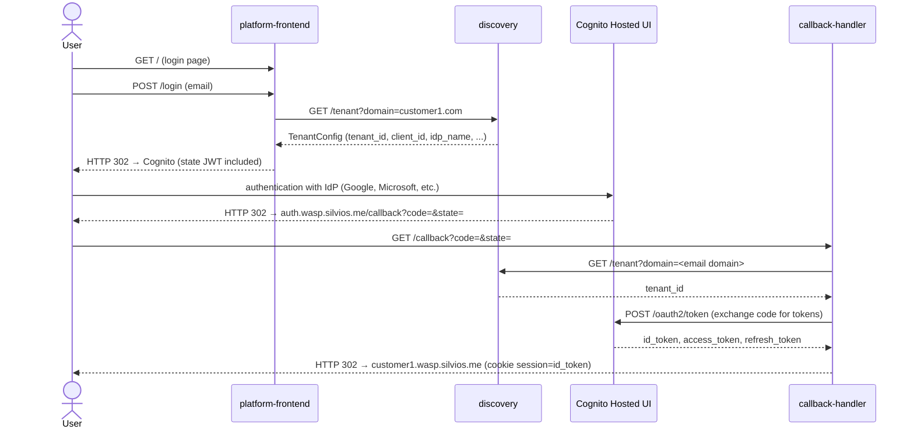

# Services

Three Python/FastAPI microservices implement the platform's multi-tenant authentication flow.

## Interaction diagram



## Services table

| Service | K8s Namespace | Subdomain | Docker Hub image |
|---|---|---|---|
| `discovery` | `discovery` | `discovery.wasp.silvios.me` | `silviosilva/wasp-discovery` |
| `platform-frontend` | `platform` | `wasp.silvios.me` | `silviosilva/wasp-platform-frontend` |
| `callback-handler` | `auth` | `auth.wasp.silvios.me` | `silviosilva/wasp-callback-handler` |

## Common stack

- Python 3.12 + FastAPI + uvicorn
- Build: `--platform linux/amd64`; tag = git short SHA (never `:latest`)
- Each service has its own `.venv`

## Run locally

```bash
cd services/<service>
python3 -m venv .venv
.venv/bin/pip install -r requirements-dev.txt
.venv/bin/pytest tests/ -v
```

## Environment variables per service

| Service | Variable | Description |
|---|---|---|
| `discovery` | `AWS_REGION` | AWS region where the DynamoDB table is |
| `discovery` | `DYNAMODB_TABLE` | Table name (e.g. `tenant-registry`) |
| `platform-frontend` | `DISCOVERY_URL` | Discovery base URL (`https://discovery.wasp.silvios.me`) |
| `platform-frontend` | `COGNITO_DOMAIN` | Cognito hostname — **without `https://`** (e.g. `idp.wasp.silvios.me`) |
| `platform-frontend` | `CALLBACK_URL` | OAuth callback URL (`https://auth.wasp.silvios.me/callback`) |
| `platform-frontend` | `STATE_JWT_SECRET` | Shared secret with `callback-handler` |
| `callback-handler` | `COGNITO_DOMAIN` | Cognito hostname — **without `https://`** |
| `callback-handler` | `CALLBACK_URL` | URL registered as `redirect_uri` in the App Client |
| `callback-handler` | `DISCOVERY_URL` | Discovery base URL |
| `callback-handler` | `STATE_JWT_SECRET` | Shared secret with `platform-frontend` |
| `callback-handler` | `COGNITO_CLIENT_SECRET_CUSTOMER1` | App Client secret for customer1 |
| `callback-handler` | `COGNITO_CLIENT_SECRET_CUSTOMER2` | App Client secret for customer2 |
